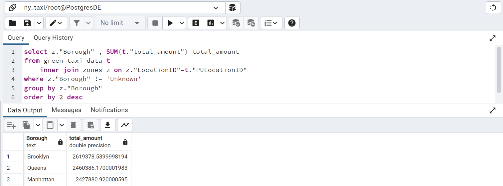

## Module 1 Homework

## Docker & SQL

In this homework we'll prepare the environment 
and practice with Docker and SQL


## Question 1. Knowing docker tags

Run the command to get information on Docker 

```docker --help```

Now run the command to get help on the "docker build" command:

```docker build --help```

Do the same for "docker run".

Which tag has the following text? - *Automatically remove the container when it exits* 

- `--delete`
- `--rc`
- `--rmc`
- `--rm`

**Answer:**

```bash
$ sudo docker run --help | grep Automatically
```


## Question 2. Understanding docker first run 

Run docker with the python:3.9 image in an interactive mode and the entrypoint of bash.
Now check the python modules that are installed ( use ```pip list``` ). 

What is version of the package *wheel* ?

- 0.42.0
- 1.0.0
- 23.0.1
- 58.1.0

**Answer:**

```bash
$ sudo docker run -it python:3.9 bash
```


# Prepare Postgres

Run Postgres and load data as shown in the videos
We'll use the green taxi trips from September 2019:

```wget https://github.com/DataTalksClub/nyc-tlc-data/releases/download/green/green_tripdata_2019-09.csv.gz```

You will also need the dataset with zones:

```wget https://s3.amazonaws.com/nyc-tlc/misc/taxi+_zone_lookup.csv```

Download this data and put it into Postgres (with jupyter notebooks or with a pipeline)

**Note:**
Read `deployment.md` and run `load_data.ipynb`

## Question 3. Count records 

How many taxi trips were totally made on September 18th 2019?

Tip: started and finished on 2019-09-18. 

Remember that `lpep_pickup_datetime` and `lpep_dropoff_datetime` columns are in the format timestamp (date and hour+min+sec) and not in date.

- 15767
- 15612
- 15859
- 89009

**Answer:**

```sql
select count(1)
from green_taxi_data t
where DATE(t.lpep_pickup_datetime) = '2019-09-18' and DATE(t.lpep_dropoff_datetime) = '2019-09-18' 
```


## Question 4. Largest trip for each day

Which was the pick up day with the largest trip distance
Use the pick up time for your calculations.

- 2019-09-18
- 2019-09-16
- 2019-09-26
- 2019-09-21

**Answer:**

```sql
select t.lpep_pickup_datetime , MAX(t.trip_distance) trip_distance
from green_taxi_data t
group by t.lpep_pickup_datetime 
order by 2 desc
```


## Question 5. Three biggest pick up Boroughs

Consider lpep_pickup_datetime in '2019-09-18' and ignoring Borough has Unknown

Which were the 3 pick up Boroughs that had a sum of total_amount superior to 50000?
 
- "Brooklyn" "Manhattan" "Queens"
- "Bronx" "Brooklyn" "Manhattan"
- "Bronx" "Manhattan" "Queens" 
- "Brooklyn" "Queens" "Staten Island"

**Answer:**

```sql
select z."Borough" , SUM(t."total_amount") total_amount
from green_taxi_data t
	inner join zones z on z."LocationID"=t."PULocationID"
where z."Borough" != 'Unknown'
group by z."Borough"
order by 2 desc
```


## Question 6. Largest tip

For the passengers picked up in September 2019 in the zone name Astoria which was the drop off zone that had the largest tip?
We want the name of the zone, not the id.

Note: it's not a typo, it's `tip` , not `trip`

- Central Park
- Jamaica
- JFK Airport
- Long Island City/Queens Plaza

**Answer:**

```sql
select zo."Zone" ZoneFrom, zd."Zone" ZoneTo, MAX(t.tip_amount) Tip
from green_taxi_data t
	inner join zones zo on zo."LocationID" = t."PULocationID"  
	inner join zones zd on zd."LocationID" =t."DOLocationID" 
where zo."Zone" ='Astoria'
group by zo."Zone", zd."Zone"
order by 3 desc
```


## Terraform

In this section homework we'll prepare the environment by creating resources in GCP with Terraform.

In your VM on GCP/Laptop/GitHub Codespace install Terraform. 
Copy the files from the course repo
[here](https://github.com/DataTalksClub/data-engineering-zoomcamp/tree/main/01-docker-terraform/1_terraform_gcp/terraform) to your VM/Laptop/GitHub Codespace.

Modify the files as necessary to create a GCP Bucket and Big Query Dataset.


## Question 7. Creating Resources

After updating the main.tf and variable.tf files run:

```
terraform apply
```

Paste the output of this command into the homework submission form.

**Answer**

```bash
(de) ubuntu@vml-mle-nic:~/projects/de_zoomcamp/01-docker-terraform$ terraform apply

Terraform used the selected providers to generate the following execution plan. Resource actions are indicated with the following symbols:
  + create

Terraform will perform the following actions:

  # google_bigquery_dataset.demo_dataset will be created
  + resource "google_bigquery_dataset" "demo_dataset" {
      + creation_time              = (known after apply)
      + dataset_id                 = "demo_dataset_20240128"
      + default_collation          = (known after apply)
      + delete_contents_on_destroy = false
      + effective_labels           = (known after apply)
      + etag                       = (known after apply)
      + id                         = (known after apply)
      + is_case_insensitive        = (known after apply)
      + last_modified_time         = (known after apply)
      + location                   = "US"
      + max_time_travel_hours      = (known after apply)
      + project                    = "vld-dtc-de-00001"
      + self_link                  = (known after apply)
      + storage_billing_model      = (known after apply)
      + terraform_labels           = (known after apply)
    }

  # google_storage_bucket.demo-bucket will be created
  + resource "google_storage_bucket" "demo-bucket" {
      + effective_labels            = (known after apply)
      + force_destroy               = true
      + id                          = (known after apply)
      + location                    = "US"
      + name                        = "vld_bucket_test_20240128"
      + project                     = (known after apply)
      + public_access_prevention    = (known after apply)
      + self_link                   = (known after apply)
      + storage_class               = "STANDARD"
      + terraform_labels            = (known after apply)
      + uniform_bucket_level_access = (known after apply)
      + url                         = (known after apply)

      + lifecycle_rule {
          + action {
              + type = "AbortIncompleteMultipartUpload"
            }
          + condition {
              + age                   = 1
              + matches_prefix        = []
              + matches_storage_class = []
              + matches_suffix        = []
              + with_state            = (known after apply)
            }
        }
    }

Plan: 2 to add, 0 to change, 0 to destroy.

Do you want to perform these actions?
  Terraform will perform the actions described above.
  Only 'yes' will be accepted to approve.

  Enter a value: yes

google_bigquery_dataset.demo_dataset: Creating...
google_storage_bucket.demo-bucket: Creating...
google_bigquery_dataset.demo_dataset: Creation complete after 0s [id=projects/vld-dtc-de-00001/datasets/demo_dataset_20240128]
google_storage_bucket.demo-bucket: Creation complete after 1s [id=vld_bucket_test_20240128]
```